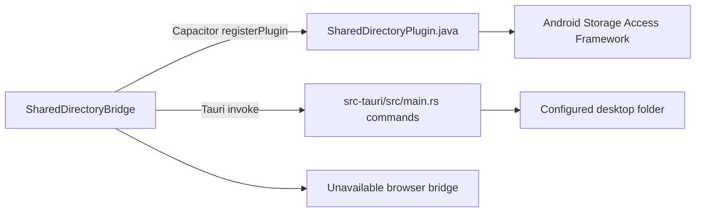

# Native shared-directory contracts

The public contract starts at `src/platform/shared-directory-bridge.ts`. `SharedDirectoryBridge` exposes `available`, `getLocation`, `chooseLocation`, `listFiles`, `readFile(path)`, and `writeFile(path, data)`; there is no bridge-level `delete` operation. Dataset replacement is expressed through writes and native recovery, so any platform page mentioning deletion refers only to internal cleanup, not a public contract. `createPlatformSharedDirectoryBridge` selects the implementation using `Capacitor.getPlatform()` and `isTauri()`; browser receives an unavailable no-op bridge.

Android registers `@CapacitorPlugin(name = "SharedDirectory")` in `android/app/src/main/java/com/peterle/fermentstation/SharedDirectoryPlugin.java`. Its methods return `{location}`, `{files}`, or `{data}` objects as required by the TypeScript adapter. `chooseLocation` uses `ACTION_OPEN_DOCUMENT_TREE`, persists read/write URI permission, and stores the URI in Android `SharedPreferences`. Desktop registers the equivalent `shared_get_location`, `shared_choose_location`, `shared_list_files`, `shared_read_file`, and `shared_write_file` commands in `src-tauri/src/main.rs`; the Tauri adapter passes `{ path, data }` for writes and `{ path }` for reads.

## Compatibility rules

- File contents cross the bridge as base64 strings; JSON encoding/decoding and photo externalization remain in `SharedDataStore`.
- Paths are relative, slash-separated, non-empty, and may not contain traversal, backslashes, or absolute components. Both Android `validRelativePath` and Rust `shared_path` enforce this boundary.
- `getLocation`/`chooseLocation` resolve to a nullable location: Android returns an object without `location` when no permission/cancel occurs, and Tauri returns `null` on no configured/cancelled selection. `listFiles` always returns a string array; `readFile` returns an object without `data`/a Tauri `null` for a missing file; `writeFile` resolves with no payload. File contents cross the bridge as base64 strings; JSON encoding/decoding and photo externalization remain in `SharedDataStore`.
- Reads and writes enforce a 64 MB file limit; recursive listing/recovery rejects nesting beyond 64 levels. Unchanged bytes are not rewritten.
- Writes use temporary sibling files and replacement/backup recovery. Android writes a temporary child, renames the existing target to a backup, renames the temporary child into place, and restores the backup or cleans remnants on failure; providers that cannot rename safely are rejected. Tauri uses filesystem rename and rollback through `atomic_write`. Android SAF replacement and recovery are not fully automated by the JS suite: the repository has only the focused relative-path unit test, not an instrumentation test for temporary/backup interruption. Treat provider rename failure, backup restoration, permission loss, and 64 MB boundaries as explicit manual/device validation until such a test exists.
- Missing permissions or unavailable runtimes produce capability errors/statuses rather than silently writing to an unintended location.

The implementation chain is TypeScript adapter → registered native method/command → platform filesystem → base64 response. Any method rename, payload change, error change, or limit change must be made in all layers and in the shared-data store assumptions. Android path behavior is covered by `android/app/src/test/java/com/peterle/fermentstation/SharedDirectoryPluginTest.java`; Rust path, file-size, atomic-write, and recovery behavior is covered by tests embedded in `src-tauri/src/main.rs`.
