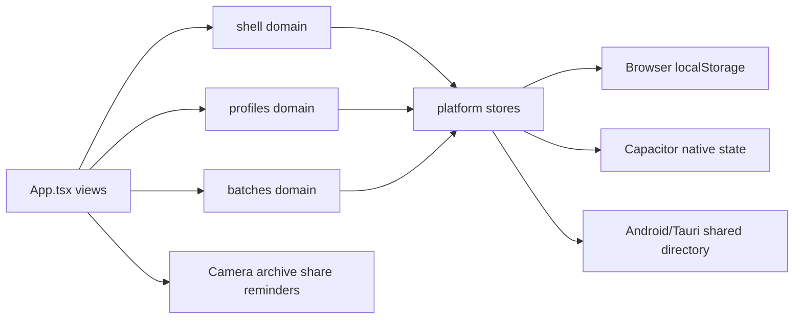

# System architecture

`src/main.tsx` mounts `App` into `#root` and loads `src/styles.css`. Vite compiles the TypeScript/React frontend; the same web bundle is hosted directly in a browser, embedded by Capacitor Android, or served by Tauri desktop. `App` is the composition root: it owns shell/profile/batch state, selects platform capabilities, initializes persistence, reconciles reminders, and routes the five destinations (`today`, `batches`, `calendar`, `profiles`, `settings`).

## Boundaries and data flow

The domain layer (`src/domain`) is pure state and rules. `profiles.ts` defines profile schemas and formula calculation; `batches.ts` snapshots profiles into batches and owns timeline/status/check/trash behavior; `shell.ts` defines navigation and preferences. The platform layer (`src/platform`) adapts those states to browser `localStorage`, Capacitor Preferences/Filesystem, a shared directory, native camera/file/share APIs, and notifications. UI handlers call domain transformations, then save the resulting aggregate through the selected store.

A batch owns a cloned `profileSnapshot`, so later profile edits do not silently change existing fermentation records. Shared persistence serializes `manifest.json` plus `records/{shell,profiles,batches}.json`; photo payloads move to `photos/` and are hydrated before `parseBatchState` (see [shared storage](../platform/storage.md) and [data interchange](../workflows/data-interchange.md)).

## Native composition

`createPlatformSharedDirectoryBridge` chooses the Android Capacitor `SharedDirectory` plugin, Tauri commands, or an unavailable browser bridge. The cross-runtime contract is canonicalized in [native contracts](native-contracts.md). Android and desktop retain the selected folder in device-local configuration; the shared dataset does not contain that path.

## UI ownership

Detailed view responsibilities and event paths belong in [UI architecture](ui.md). The domain pages are the change targets for behavior changes, while platform pages own serialization and capability boundaries. No server or remote API exists; synchronization is file-based and conflict-preserving rather than merge-based.

## Focused validation

Use `npm run typecheck` for frontend contracts, `npm test` for domain/platform/UI behavior, `npm run build` for the Vite bundle, and platform-specific commands in [operations](../operations/build.md). Rust command/path invariants are tested with `cargo test --manifest-path src-tauri/Cargo.toml` when the Rust toolchain is available.
