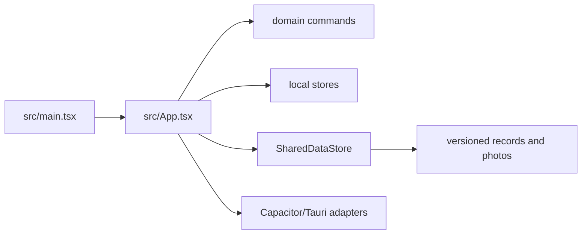

`src/main.tsx` mounts `App` under React StrictMode. `src/App.tsx` is the composition root and owns Today, Batches, Calendar, Profiles, and Settings destinations, plus batch detail/edit forms, profile editor dialogs, timeline/photo/pH/check actions, archive import/export dialogs, shared-folder migration/conflict UI, reminder settings, and native lifecycle effects. It imports pure commands from [batches](../domains/batches.md), [profiles](../domains/profiles.md), and shell navigation rather than embedding domain rules.

React state owns `shell`, `profileState`, `batchState`, open batch/profile IDs, native readiness, and shared-storage status. Startup bootstraps browser stores, initializes shared storage, applies a shared snapshot when configured, otherwise loads native state, then projects dates and discards expired trash. Effects persist native state only when ready and no shared location is authoritative; shared reload runs on focus/app activation. Camera restoration and reminder reconciliation are effect-driven boundaries.

Tests in `src/App.test.tsx` cover user-facing navigation and workflows; domain/platform suites prove the invariants behind handlers. `navigate` delegates destination changes to `selectDestination`; `updatePreferences` updates shell preferences and calls the shell store. Profile and batch handlers call domain CRUD/mutation functions, then `saveProfiles`/`saveBatches` (or the shared equivalents). App tests explicitly cover settings persistence, profile editing, navigation, and Fold6 posture preservation: the latter keeps the selected destination and unsaved draft while layout changes. Changes to a screen should trace from its App handler to the owning domain/platform symbol and focused test, not duplicate business logic in JSX. See [storage](../platform/storage.md) and [interchange](../workflows/data-interchange.md) for authority and protocol details.
