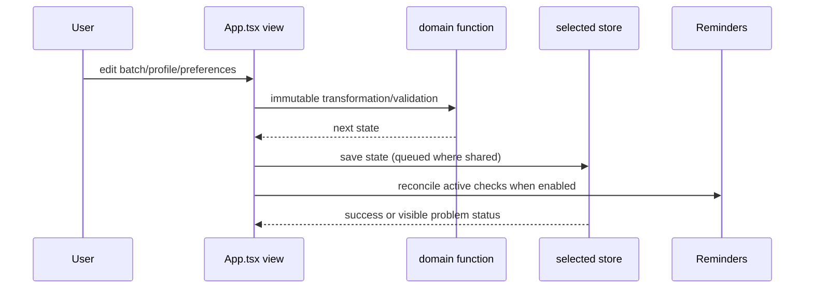

# React UI and state orchestration

`src/App.tsx` is the frontend composition root and the canonical owner of user-facing behavior. `App()` creates shell, profile, and batch state; initializes native/shared storage; applies restored snapshots; and renders the selected destination. `navigate`, `updatePreferences`, `saveProfiles`, and `saveBatches` are the principal state transitions. Persistence is intentionally downstream of domain updates: handlers compute a new immutable state, update React state, then enqueue the corresponding store write and reminder reconciliation.

## View boundaries

`App` keeps `destination`, shell preferences/formula terms, profile state, batch state, shared-storage status, and transient modal/editor state at the composition root. It passes each view explicit callbacks rather than letting views own persistence: `BatchView` receives `onChange`, `onCreate`, `onDelete`, `onNavigate`, and `onOpen`; `Profiles` receives `onSave`, `onDelete`, and editing-state callbacks; `SettingsView` receives preference/formula-term handlers, archive handlers, storage selection/reload/migration handlers, and restore callbacks. `CalendarView` is read-only over the current batch list and navigates back to the owning batch.

The shell renders the same selected destination in responsive layouts; React state is not recreated when posture/layout changes, so an open editor and unsaved form draft remain available. `selectDestination` returns the same state object for a no-op and otherwise immutably changes only `destination`. Settings saves `units`, `checkReminders`, and `suggestions` through `updatePreferences`; formula terms are validated for unique identifier-like names before becoming available source/result vocabulary in the profile editor and calculation presentation.

- **Today** prioritizes active batches with due/overdue checks and presents the next actions.
- **Batches** filters by `active`, `ready`, `to-fridge`, or all, creates batches from profiles, opens `BatchCard`, and exposes deletion/recovery.
- **Calendar** derives events from finish dates and active checks through `calendarEvents`.
- **Profiles** edits guidance, inputs, calculations, pH zones, temperatures, durations, and checks; save uses `validateProfile` before publishing.
- **Settings** edits units, reminders, suggestions, formula terms, shared-folder selection, archive import/export, journal export, and trash restoration.

`BatchView` and `BatchCard` are the primary batch workflow boundary: forms add notes, measurements, pH, temperature, photos, status changes, checks, inputs, and calculation overrides through domain functions. `BatchCard` renders the latest pH and temperature timeline readings against the profile snapshot's pH zones and temperature bounds, marking out-of-range pH as an alert and below-range temperature as cool. `CalendarView` and the Today upcoming strip open a single owning batch directly; when several batches share a date, `BatchPicker` provides a dismissible accessible chooser. `Profiles` edits structured rows rather than evaluating arbitrary JavaScript. `SettingsView` owns archive file selection/download and shared-storage migration dialogs.

Calendar selection behavior is detailed in [calendar and upcoming navigation](../workflows/calendar.md).

## Lifecycle and fallbacks

On startup, `App` loads browser/native state and attempts shared storage when available. A valid shared snapshot can replace local state; migration explicitly asks whether shared or device data is canonical. Camera restoration listens for Capacitor `appRestoredResult` and reattaches a captured photo to the pending batch flow. Unsupported browser capabilities fall back to ordinary file inputs/downloads, and reminder permission or scheduling failures do not make Today/Calendar incorrect: those screens derive from batch checks.

## Tested change surface

`src/App.test.tsx` is the narrowest end-to-end UI evidence: it covers navigation, profile editing/validation, batch creation and filtering, timeline and pH flows, checks, settings, archive import/export, and native fallbacks. When changing a view, update this suite for the user-visible path; when changing a rule, add or update the focused domain suite instead. Platform boundary details belong in [storage](../platform/storage.md), [device integrations](../platform/device-integrations.md), and [platform lifecycle](../workflows/platform-lifecycle.md).
