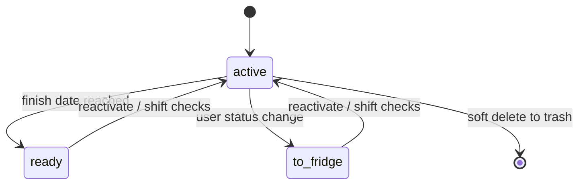

`src/domain/batches.ts` owns the batch aggregate. `Batch` stores a cloned `profileSnapshot`, numeric inputs, calculated values, status, finish date, recurring checks, timeline entries, and timeline trash; `BatchState` separates active records from trashed batches.

## Lifecycle and invariants

`createBatch` snapshots the profile, fills defaults, rejects non-finite/negative inputs, creates check due dates, calculates outputs, and optionally projects today’s status. Statuses are `active`, `ready`, and `to-fridge`. `changeBatchStatus` records `checksPausedAt` when leaving active and shifts all due dates by paused calendar days when reactivated. `updateBatchForDate` promotes an active batch whose finish date has arrived. Checks can be added, renamed, adjusted, completed, and queried by `dueBatchChecks`; non-active batches reject check mutations.

`setBatchInput` and `overrideBatchCalculation` enforce known names and nonnegative values. Calculations use the profile snapshot, so later profile edits cannot silently change an existing batch. pH entries go through `addPhReading`/`updatePhReading`, allowing two decimal places; `phZoneLabel` uses snapshot zones and `phWarning` flags values outside 0–14.

Timeline operations (`addTimelineEntry`, `updateTimelineEntry`, `deleteTimelineEntry`, `restoreTimelineEntry`) preserve IDs and use `timelineTrash`; `discardExpiredTimelineEntries` and the batch equivalents enforce the 30-day soft-delete window. `restoreTimelineEntry` and `restoreBatch` are reversible while an item remains in trash; `discardExpiredTimelineEntries` and `discardExpiredBatches` permanently remove expired records and are irreversible through the domain API. `calendarEvents` projects finish dates and due checks without becoming stored truth. `filterBatches`, `prioritizeToday`, and `statusLabel` serve the UI.

Focused evidence is `src/domain/batches.test.ts`, which exercises creation defaults, status/check pause shifting, calculation and pH failures, timeline restore/expiry, filtering, and calendar projections. Callers are in `src/App.tsx`; persistence parsing is in `src/platform/batch-store.ts`. Changes to aggregate fields require the parser, archive/shared serializers, UI callers, and this suite to move together.
