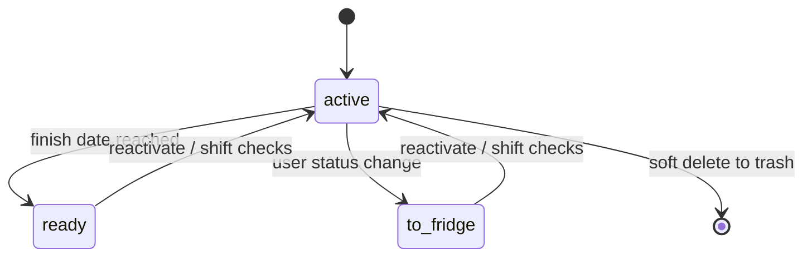

`src/domain/batches.ts` owns the batch aggregate. `Batch` stores a cloned `profileSnapshot`, numeric inputs, calculated values, status, finish date, recurring checks, timeline entries, and timeline trash; `BatchState` separates active records from trashed batches.

## Lifecycle and invariants

`createBatch` snapshots the profile, fills defaults, rejects non-finite/negative inputs, creates check due dates, calculates outputs, and optionally projects today’s status. Statuses are `active`, `ready`, and `to-fridge`. `changeBatchStatus` records `checksPausedAt` when leaving active and shifts all due dates by paused calendar days when reactivated. `updateBatchForDate` promotes an active batch whose finish date has arrived. Checks can be added, renamed, adjusted, completed, and queried by `dueBatchChecks`; non-active batches reject check mutations. A completed check updates `lastCompletedDate`, advances `nextDueDate`, and emits a check timeline entry; `dueBatchChecks` sorts by due date/name/id and excludes paused batches.

Status is timeline-derived when status entries are added, edited, or deleted: `latestTimelineStatus` scans the chronologically sorted timeline from the end, and `latestPauseDate` tracks the most recent active-to-paused transition. Editing/deleting a status entry therefore reapplies status and pause semantics rather than merely changing display data. `calendarEvents` emits every finish date and active-batch check, then deterministically sorts by date, batch name, and label.

`createBatch` uses `cloneProfile`, copies each named input from the caller or profile default, initializes `finishDate` from `expectedDurationDays`, creates stable per-batch check IDs and due dates, then calls the private `recalculateBatch`. `recalculateBatch` evaluates every snapshot calculation from current `inputValues`; a missing input records `{ suggested: null }`, a runtime-invalid formula is also incomplete rather than fatal, and an existing `override` is preserved instead of recalculated. `setBatchInput` validates a known profile input and triggers this recalculation, while `overrideBatchCalculation` validates a known calculated name and stores a batch-local nonnegative override. Thus suggested values follow inputs, but explicit overrides remain authoritative until replaced.

`setBatchInput` and `overrideBatchCalculation` enforce known names and nonnegative values. Calculations use the profile snapshot, so later profile edits cannot silently change an existing batch. pH entries go through `addPhReading`/`updatePhReading`, allowing two decimal places; `phZoneLabel` uses snapshot zones and `phWarning` flags values outside 0–14.

Timeline operations (`addTimelineEntry`, `updateTimelineEntry`, `deleteTimelineEntry`, `restoreTimelineEntry`) preserve IDs and use `timelineTrash`; `discardExpiredTimelineEntries` and the batch equivalents enforce the seven-day soft-delete window. `restoreTimelineEntry` and `restoreBatch` are reversible while an item remains in trash; `discardExpiredTimelineEntries` and `discardExpiredBatches` permanently remove expired records and are irreversible through the domain API. Deleted timeline entries retain their complete payload, including photo data URLs and status entries, so restoration can reinsert them in date order and recompute status. Batch trash is separate from active batches; restoration skips an already-present ID rather than duplicating it. The UI persists each delete/restore through `saveBatches`; if that write fails, the shared store exposes a problem/write-failed state while the in-memory state remains available for retry. `calendarEvents` projects finish dates and due checks without becoming stored truth. `filterBatches` returns all batches for `all`, otherwise only the exact requested status. `prioritizeToday` performs a stable copy-sort: when a date is supplied, batches with due checks for that date are promoted first; remaining order is status priority (`ready`, `active`, `to-fridge`) and then finish/name tie-breakers as implemented in `batches.ts`. `statusLabel` supplies the display vocabulary without changing stored status. Focused assertions in `src/domain/batches.test.ts` cover filters, Today prioritization, due checks, calendar projections, validation failures, and timeline/status recomputation.

Focused evidence is `src/domain/batches.test.ts`, which exercises creation defaults, status/check pause shifting, calculation and pH failures, timeline restore/expiry, filtering, and calendar projections. Callers are in `src/App.tsx`; persistence parsing is in `src/platform/batch-store.ts`. Changes to aggregate fields require the parser, archive/shared serializers, UI callers, and this suite to move together.
