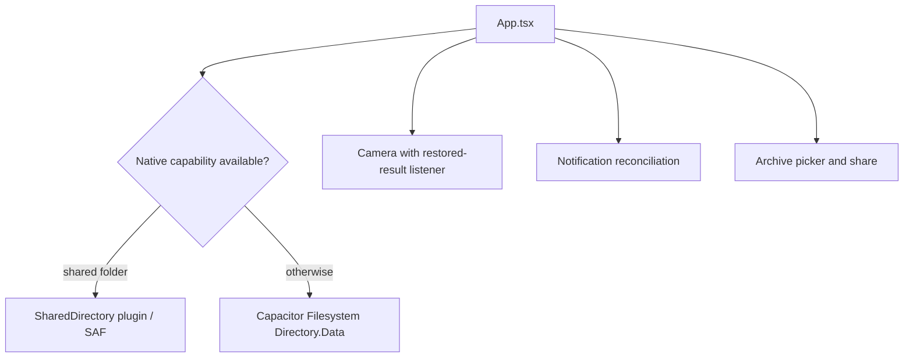

# Android and Capacitor integration

`capacitor.config.ts` identifies `com.peterle.fermentstation` and uses `dist` as the web directory. `MainActivity`, `AndroidManifest.xml`, and Gradle configure the container. The `SharedDirectory` plugin under `android/app/src/main/java/com/peterle/fermentstation` implements the same methods as the TypeScript bridge: location, folder selection, listing, bounded reads, and writes.

The plugin uses Storage Access Framework tree URIs and persists URI permissions. It validates relative paths, avoids unsafe links, limits traversal and file sizes, and replaces documents through temporary/backup files with recovery. Its `validRelativePath` behavior is covered by `SharedDirectoryPluginTest`; changes to Java method names or registration require matching changes in `shared-directory-bridge.ts`.

When no shared folder is active, `src/platform/native-store.ts` uses Capacitor Filesystem `Directory.Data` for shell, profile, and batch records. Photos are written separately and represented on disk by `photoRef`, then hydrated to data URLs before batch parsing. `camera.ts` handles camera capture and `appRestoredResult` after process interruption. `reminders.ts` reconciles active checks using deterministic notification IDs; permission or scheduling failures are swallowed so Today and Calendar remain authoritative. `native-transfer.ts` uses cache, Share, and the file picker for archive exchange.

The primary evidence is `src/App.tsx` capability selection and lifecycle effects, the platform adapters, Android manifest/plugin sources, and their focused tests. Validate frontend behavior with `npm test` and `npm run build`; use `npm run cap:sync` and `npm run android:build` for the Android packaging path.