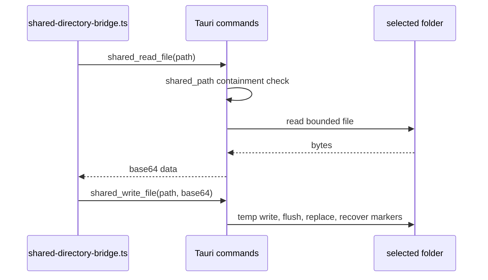

# Tauri desktop filesystem

`src-tauri/src/main.rs` is the desktop implementation of `SharedDirectoryBridge`. `main` registers `shared_get_location`, `shared_choose_location`, `shared_list_files`, `shared_read_file`, and `shared_write_file`; `src/platform/shared-directory-bridge.ts` invokes these names. The selected path is stored outside the shared dataset at the Tauri app config location as `shared-directory.txt`.

## Safety and lifecycle

`required_root` rejects an unconfigured installation. `shared_path` accepts only non-empty, relative, forward-slash paths, canonicalizes existing ancestors, and prevents escape from the selected root. Listing skips symlinks, checks containment, and limits nesting to 64 levels. Reads and writes are base64 at the invoke boundary and reject files over 64 MB.

Writes use `atomic_write`: flush a sibling `.tmp-<nonce>`, rename the old target to `.bak-<nonce>`, install the temporary file, and remove the backup; failure restores the prior target. `recover_files` removes redundant markers or restores missing targets before listing. These rules protect the manifest/records protocol described in [shared storage](storage.md).

The Rust test in `src-tauri/src/main.rs` proves traversal, absolute, and backslash paths are rejected. Change the command registration, Rust path logic, and JS bridge together; validate with `cargo test --manifest-path src-tauri/Cargo.toml` and the shared-data tests when Rust is available.