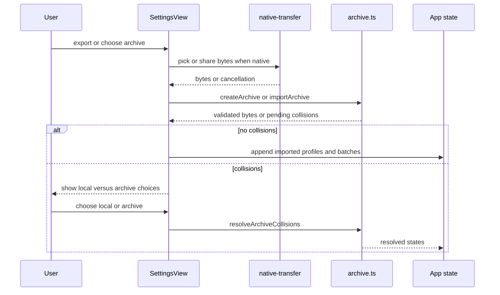

# Archive transfer workflow

`SettingsView` in `src/App.tsx` owns the user workflow. Export first calls `createArchive(profileState, batchState)`, then delivers the resulting bytes through `native-transfer.ts` when native APIs are available or a browser download otherwise. Import obtains bytes from a native file picker or browser file input, passes them to `importArchive`, and does not publish any imported record until validation and collision handling succeed.

The diagram shows the Settings-owned transfer path; native transport supplies bytes but never decides record validity or merge semantics.

`createArchive` clones state, validates profiles and stable IDs, replaces photo data URLs with SHA-256-addressed ZIP members, and emits schema-version-1 `manifest.json` plus `records.json`. `importArchive` rejects invalid ZIPs, compressed archives over 200 MB, expanded content over 250 MB, unknown members, hash mismatches, malformed records, duplicate IDs, invalid photos, dates, calculations, checks, or profile snapshots. It hydrates photo data URLs only after manifest membership and hash checks pass.

An import with no same-ID records appends profiles, active batches, and trash. A collision returns the unchanged local states plus `pendingProfileState` and `pendingBatchState`; the UI keeps that pending result in modal state. `resolveArchiveCollisions("local"|"archive")` replaces only colliding records while retaining non-colliding records from both sides. Cancellation, picker failure, malformed archives, and unresolved collisions leave published local state unchanged. Native sharing/picking in `native-transfer.ts` is therefore a transport boundary, not a second persistence or validation implementation: export calls `Share.share({ title: "FermentStation archive", url: cacheUri, type: "application/zip" })` after writing a temporary cache file; import calls the picker with `types: ["application/zip"]` and converts the selected `{ path, data?, mimeType? }` response/base64 payload to bytes. Browser export uses a download and browser import uses a file input; cancellation yields no bytes and leaves state unchanged.

Focused evidence is `src/platform/archive.test.ts` for archive limits, tamper detection, schema validation, photo round trips, merges, and collision strategies, plus `src/App.test.tsx` for Settings export/import, picker fallback, errors, and collision UI. Validate with `npm test -- src/platform/archive.test.ts src/App.test.tsx` and `npm run typecheck`; native picker/share behavior requires Android or desktop validation.
