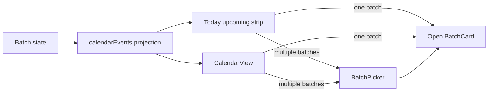

# Calendar and upcoming batch navigation

The Calendar destination and the Today batch view consume the same derived `calendarEvents` projection from `src/domain/batches.ts`. Events represent finish dates and active-batch checks; they are not persisted calendar records. `App` supplies `CalendarView` with the current batches and an `onOpen` callback that navigates to Batches and sets `openBatchId`, so calendar navigation ends at the owning `BatchCard`.

## Selection behavior

A date with events is a button. If all events belong to one batch, activating the date opens that batch immediately. If multiple batch IDs share the date, `BatchPicker` lists each batch and its labels, then opens the selected ID. The picker is a modal dialog with a close button, closes on backdrop click or `Escape`, and prevents clicks inside the dialog from dismissing it. Upcoming-list rows and overdue rows are also buttons that open their batch.

The event list remains deterministic because `calendarEvents` sorts by date, batch name, and label. The UI groups only by date/batch ID; it does not alter event ownership or status. A future calendar change should preserve this separation: change projection semantics in the domain module and its tests, but keep selection/accessibility behavior in `src/App.tsx` and `src/App.test.tsx`.

## Change navigation and validation

- **UI or accessibility change:** start at `CalendarView`, `BatchPicker`, or the `BatchView` upcoming strip in `src/App.tsx`; update the calendar workflow assertions in `src/App.test.tsx` (direct open, multi-batch choice, backdrop, Escape, and calendar/upcoming parity).
- **Event semantics change:** inspect `calendarEvents` and its focused domain tests in `src/domain/batches.test.ts`; confirm finish dates and active checks still project correctly.
- **Minimal check:** `npm test -- src/App.test.tsx`.
- **Broader check only when crossing shared domain or build boundaries:** run the focused domain suite or `npm run typecheck`; packaging checks are not required for ordinary calendar changes.

This page covers user-facing calendar selection. Batch lifecycle, status, check, and timeline invariants remain canonical in [the batch domain](../domains/batches.md), while composition and persistence ownership remain in [the React UI](../architecture/ui.md).
