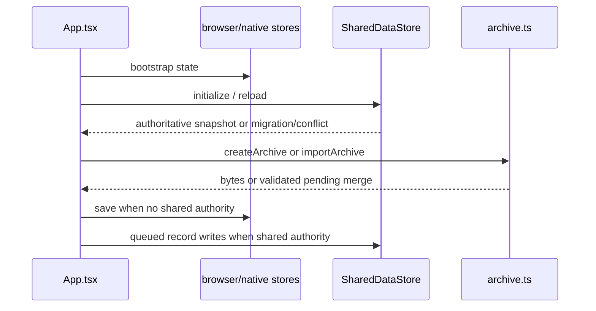

FermentStation has three distinct data paths. Browser/native persistence stores parsed `ShellState`, `ProfileState`, and `BatchState` locally. Shared storage uses manifest plus separate records and external photos, with canonical-folder selection and conflict preservation. Portable archives use ZIP records, content hashes, and collision review. They must not be treated as interchangeable schemas.

Photos are data URLs in domain memory, external files in shared datasets, and content-addressed `photos/<hash>` members in archives. Shared writes use an in-progress manifest and preserve conflict files; archive imports reject tampering and defer same-ID collisions. `App.tsx` provides the user entrypoints for settings/shared migration and archive dialogs. Evidence is `src/App.tsx`, `platform/shared-data-store.ts`, `platform/archive.ts`, their tests, and the native bridges. Any schema or photo change must update both protocols separately.
