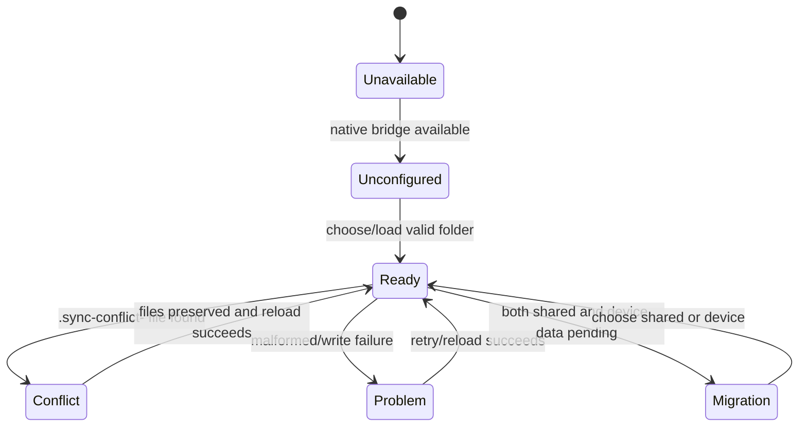

# Cross-platform lifecycle

At runtime, `createPlatformSharedDirectoryBridge` chooses Android, Tauri, or unavailable browser behavior. Separate native state in `native-store.ts` uses Capacitor `Directory.Data` for serialized state/photos; browser stores use localStorage adapters. Shared-folder state is an additional canonical-copy workflow, not an implicit merge.

## Startup, synchronization, and recovery

`App` initializes local state, then calls `SharedDataStore.initialize` when the bridge is available. The store validates `manifest.json` schema version 1 and all three records before accepting a snapshot. Migration stores a pending marker and requires an explicit canonical choice; choosing device backs up existing shared records before writing the current snapshot. Shared writes are serialized through a promise queue, mark `writeFailed` on error, externalize photos to `photos/<encoded batch>/<encoded entry>`, and expose `ready`, `conflict`, `migration`, or `problem` statuses. Conflict files are reported and preserved, never loaded as canonical records or deleted.

Camera capture in `camera.ts` is capability-gated. Android process death can return a Capacitor `appRestoredResult`; `listenForRestoredCameraPhoto` lets `App` recover the pending photo flow. Desktop/browser use file inputs when native capture is unavailable. `native-transfer.ts` similarly prefers native archive pick/share and falls back to browser download/upload.

Reminder reconciliation in `reminders.ts` requests permission, cancels previously scheduled notifications, and schedules current due checks. If permission or scheduling fails, batch state remains authoritative and Today/Calendar continue to derive due work from `dueBatchChecks` and `calendarEvents`; users see a failure rather than stale reminders.

## Focused evidence

`shared-data-store.test.ts` covers schema rejection, conflicts, migration, queued writes, photo round-trips, and failures. `native-store` behavior is exercised through platform store tests and `App.test.tsx` native fallback scenarios. `camera.ts`, `reminders.ts`, and `native-transfer.ts` are capability boundaries with browser-safe fallbacks; device process-death, notification-provider, and SAF-specific behavior still needs manual platform validation. See [data interchange](data-interchange.md) and [device integrations](../platform/device-integrations.md).
