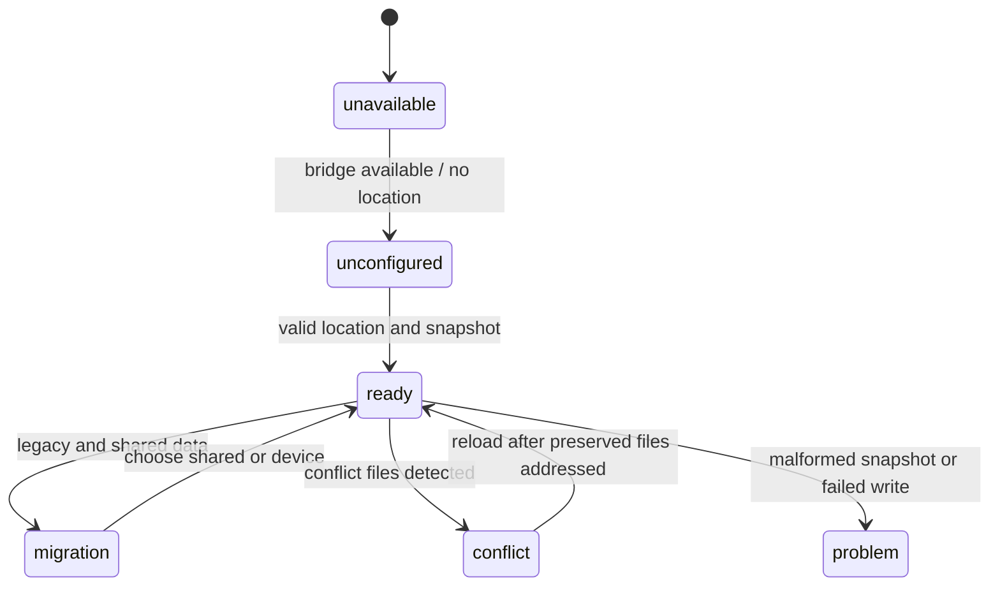

# Shared-folder synchronization and migration

`SharedDataStore` owns the shared-folder lifecycle; `App.tsx` initializes it and presents migration/conflict actions. Its status state is `unavailable`, `unconfigured`, `ready`, `migration`, `problem`, or `conflict`. A valid snapshot consists of `manifest.json` plus shell, profile, and batch records; malformed or incomplete records are rejected as a whole.

On startup or reload, the store obtains the configured location, recovers platform markers, checks schema version 1 and `writeInProgress`, parses all records, and hydrates photo references. Files matching `.sync-conflict-` are reported but never loaded or deleted. If both legacy device data and shared data exist, the store holds the shared snapshot pending an explicit `shared` or `device` decision. Choosing device backs up current files before writing the canonical snapshot.

Saves are serialized through a promise queue. A multi-record write marks the manifest in progress, writes records and externalized photos, then clears the marker. A failed write blocks subsequent reload assumptions and reports `problem`; platform adapters provide atomic or crash-resistant replacement and recovery. This is file synchronization, not merge-based live database sync.

Photos cross the boundary as data URLs in memory but as `photos/<batch>/<entry>.<extension>` with relative `photoRef` values in the shared records. The canonical evidence is `src/platform/shared-data-store.ts`, `shared-directory-bridge.ts`, `docs/shared-data-format.md`, and `shared-data-store.test.ts`, whose cases cover migration, interrupted writes, conflicts, photo hydration, and unchanged-file avoidance. Change the store state machine and bridge together; validate with `npm test`.